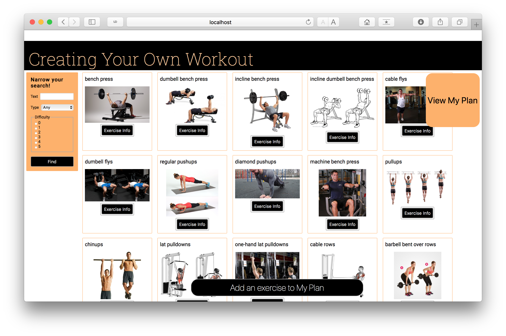

# CS 290 - Final Project (Group 23) 

A website to create your own workout.

(screenshot probably out of date)

## [Class webpage](http://web.engr.oregonstate.edu/~hessro/teaching/cs290-f18)
* Final project description  
* Demo signup  
* Group evaluation

## [Final project assignment description](https://docs.google.com/document/d/1dMv_TcO9pJf3KbpkMrkhCeSZ0pWolj0t0k_uR6e-ufs/edit)

## Some things to note:

* I had to use `chmod +x ./node_modules/.bin/handlebars` to fix this compile error:    

      $ npm start
        
      sh: /Users/justinmai/Documents/Git/CS290-FinalProject/node_modules/.bin/handlebars: Permission denied

